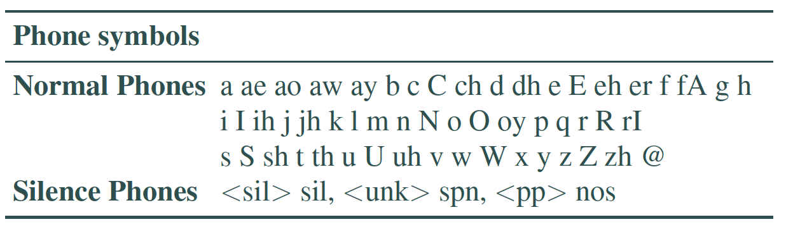
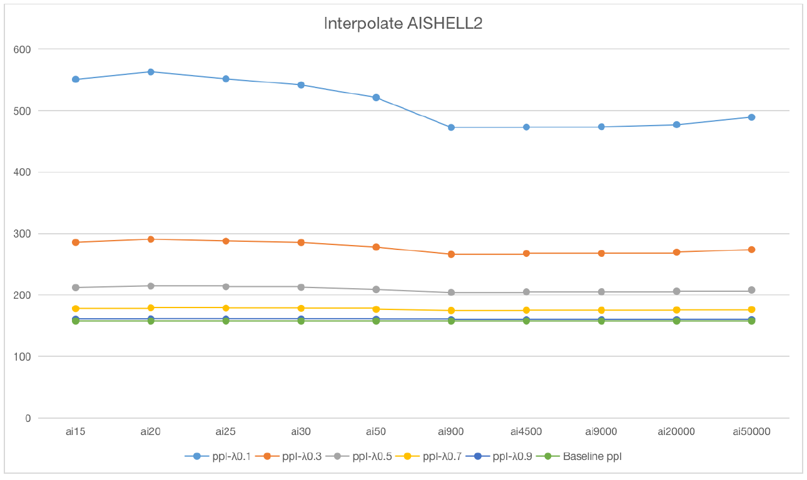

# Automatic Speech Recognition (Only Report):   
> This is a project of building an HMM ASR with Mandarin-English Code-Switching dataset.  
  
> Dataset:  
> SEAME: A Mandarin-English code-switching corpus recorded with 156 speakers in Singapore (36.8%) and Malaysia (63.2%) of balanced gender aging from 19 to 33.  
> AISHELL2: A monolingual Mandarin corpus, with 1991 speakers of both northern and southern accents and balanced gender of 42.4% male and 57.6% female.  
> LibriSpeech: A monolingual English corpus. Derived from audio books, part of the LibriVox project,
> Goal: Build a code-switching ASR system and optimize it in language model.   
  

## Overview
* [Toolkits](#toolkits) 
* [Model](#model)
* [Setup](#setup)  
* [Results](#results)

## Toolkits
* kaldi  
* shell (in data preprocessing)  

## Evaluation metrics
* For all metrics, lower the better.
* perplexity  
* WER (word error rate)  
* CER (character error rate)  

## Setup   
* ASR = Acoustic model + Language model  

* Prounciation dictionary.  
* Used to build the acoustic model. It contains words (lexicon) and corresponding pronunciation (phoneme sequence).  
* The dictionary includes 16011 English words and 11383 Chinese words with five tones.
 

* Language Model.  
* The baseline language model of the N-gram (unigram, bigram, and trigram) with both add-one smoothing and Kneser-Ney smoothing:  

N-gram    | add-one smoothing    | kneser-ney smoothing
----------| -------------------- | --------------------
unigram   |   346.842            |   348.595
bigram    |   599.813            |   161.232
trigram   |   1127.87            |   157.367

## Results 
 
Model        | WER           | CER
------------ | ------------- | -------------
Baseline     | 64.53%        | 54.06%
w/o `<pp>`   | 64.37%        | 53.69%
w/o `<pp>` & `<unk>` | 63.60% | 53.30%

## Optimization on LMs.  
  

* CER performs better than WER because it considered the segmentation of Chinese characters and the insertion of `<pp>`, `<unk>`.  
* The optimization is not ideal indicates that code-switching is not the simple multiplication of two languages.
