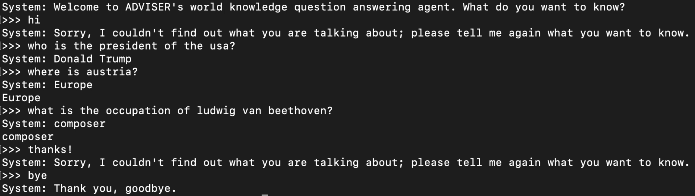

# Dialog system  
> This is a project of building a relation predictor in semantic parser of an knowledge base question answering system.  
  
> Dataset: KBQA dataset of Wikidata build by [@csqa](https://amritasaha1812.github.io/CSQA/).  
> Goal: To predict the relation connection between subject & object entities.  
> Integration: Adviser dialog system framework [@adviser](digitalphonetics.github.io/adviser/).  
  
> This is a collaboration work with [@e-tony](https://github.com/e-tony).

## Overview
* [Model](#model)
* [Integration](#integration)
* [Toolkits](#toolkits)
* [Setup](#setup)
* [Demo](#demo)

## Model   
* MLP  
* Bert embeddings  

## Integration  
* Adviser dialog system  

## Toolkits
* pytorch 
* tensorflow

## Setup
1. install adviser toolkits & environment   
2. Add `dialog_system` file under the directory: `adviser/adviser/examples/qa/` and change the file name into `semanticparser`
3. Run `run_chat_mlp.py` under `adviser/adviser/examples/qa/`

Describe how to install / setup your local environement / add link to demo version.

## Usage
Show examples of usage:
`put-your-code-here`

## Demo
Here is a demo of using adviser system in QA domain with our model.  
  

* It can answer simple worldwide knowledge questions. (latest update: Oct. 2020)
* The model reaches macro F1 83%

