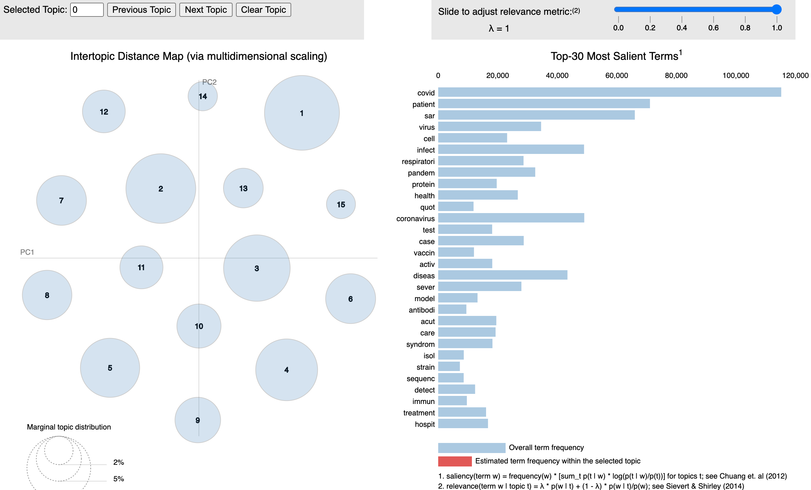

# Topic modeling in LDA, Dynamic LDA:   
> This is a project of building a LDA (& dynamic LDA) model to cluster topics in Covid-19 dataset.  
  
> Covid-19 dataset: Covid-19 related articles from [@PubMed](https://pubmed.ncbi.nlm.nih.gov/). (Until 01/Aug/2020)  
> Goal: Cluster topics and subtopics in Covid-19 dataset to find the hidden semantic structure.  
> Futurework: Dynamic, embedding, dynamic embedding, integration with supervised learning, summarization.  
  

## Overview
* [Model](#model)
* [Toolkits](#toolkits)  
* [Setup](#setup)  
* [Semantic structure](#semantic-structure)  

## Model   
* LDA.  
* Dynamic LDA.  

## Evaluation metrics
* Log-likelihood
* Perplexity
* Coherence score

## Toolkits
* gensim 
* sklearn
* nltk
* snowball stemmer

[//]: ## (Setup) 

[//]: ## (Usage) 
[//]: # (This is a comment.)
[//]: # (This is a comment on a new line.)

## Semantic structure
Here is a demo of a 15 topic clustering result of LDA model.  
  

* Feature 1
* Feature 2

